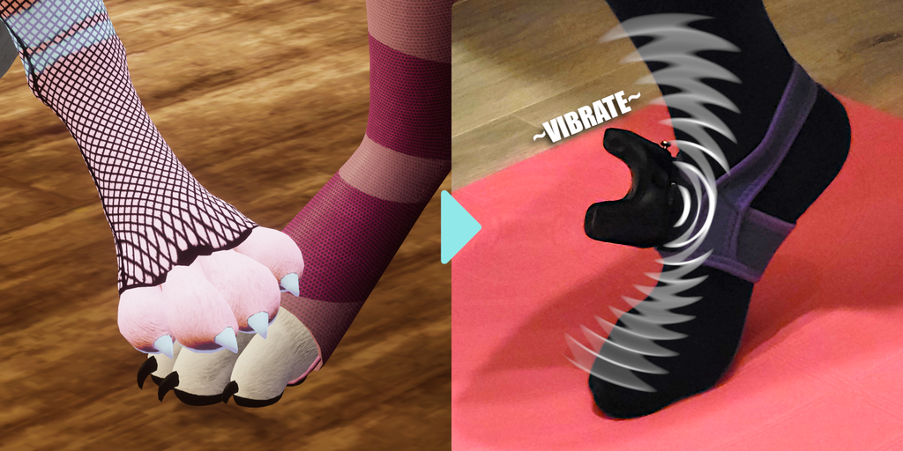
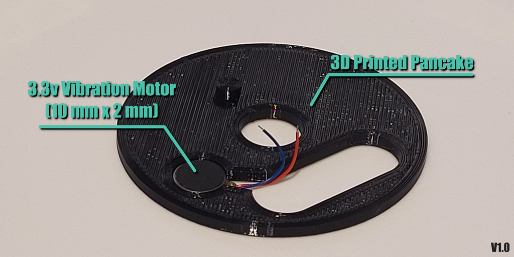
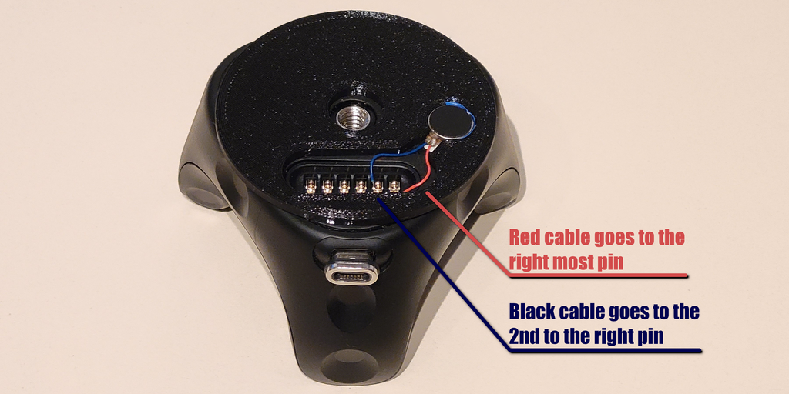
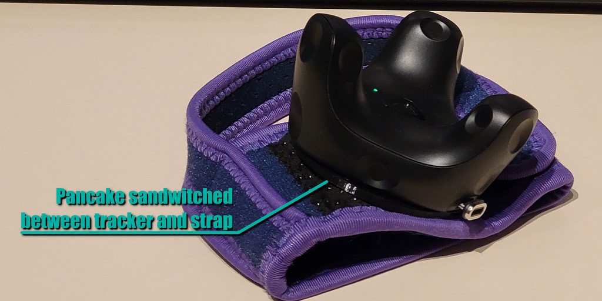
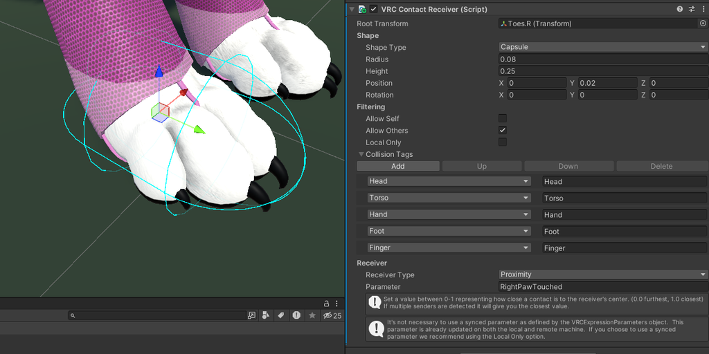
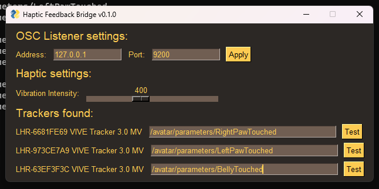

# VRChat Haptic Pancake (for trackers) [PAGE IS WIP]
A dirt cheap solution to enable haptic feedback on the vive (and other OpenVR compatible) trackers

# Prerequisites

1. 3D printer (or access to a 3D printer service)
2. A vibration motor for each tracker. I recommend [this one.](https://www.aliexpress.com/item/1005004653448729.html "Link to Aliexpres")

# Guide
1. Let's 3D print the pancake! You can use any material, but using a TPU will grand an extra dampening effect what can improve your tracking.
2. Put the motor inside. If it feels lose, use a bit of duct tape on the side.

3. Attach the cables accoring to the image. Push the pogo pins a bit down with one finger and snap the cable inside its locking mechanism.

4. Screw back the tracker on the strap

5. Prepare your avatar by adding VRC Contact Receiver component to each bone you wear your tracker on.

6. Add the parameters to the avatar's parameters
7. Upload your avatar

8. Run the bridge app, match the trackers with the declared parameters
