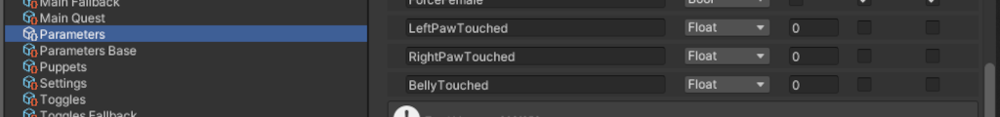

# VRChat Haptic Pancake (for VIVE Tracker (3.0))
A cost-effective solution to enable haptic feedback on the vive (and other OpenVR compatible) trackers in VRChat (Or other OSC compatible VR games)

## Contact

Please join our Discord for updates and any questions.

# Prerequisites

1. Access to a 3D printer (or a 3D printer service)
2. A 10x2mm, 3.3V max, micro DC vibration motor for each tracker. (recommended: [Micro DC Vibrating Motor](https://www.aliexpress.com/item/1005004653448729.html "Link to Aliexpres"))

# Guide

1. 3D Print the pancake:
   * Download and print the STL file from the [Releases](https://github.com/Z4urce/VRC-Haptic-Pancake/releases) page.
   * Any material should work, however the recommended material is TPU as its dampening effect may reduce strain on the IMU sensors, which could negatively impact tracking performance.
   * Place the motor in its designated hole. If the fit isn't snug enough, adhesive tape (such as duct tape) may be used.

   

2. Attach the cables:
   * Push the pogo pins down with a finger or nail, then insert the corresponding motor's cable inside its housing. The pressure of the pogo pin's spring should lock it in place.
   * Refer to the image for a visual explanation

   

3. Screw back the tracker on the strap

   

4. Prepare your avatar. (Repeat for every tracker)
   * Add a VRC Contact Receiver component to each bone where you wear your tracker.
   * Ensure proper positioning and enable only "Allow Others" in the Filtering settings.
   * Define which collision tags will trigger haptics by adding specific collision tags.
   * Set the Receiver Type to Proximity (currently the only supported type in the bridge app).
   * Come up with a unique name for the parameter (e.g., 'LeftFootTouched').

   

5. Add Parameters to Avatar:
   * Add the assigned parameters from the previous step to your avatar's parameters.

   

6. Upload your avatar
   * If updating an existing avatar, clear the AppData\LocalLow\VRChat\VRChat\OSC\ directory to ensure VRChat recognizes the new parameter.

7. Run the Bridge App:
   * Execute the EXE file from the Releases page.
   * Match the trackers with the declared parameters.
   * Use the 'Test' button to send a short vibration (note: the app requires SteamVR running in the background).
     
   

8. Enjoy and have fun!

# Planned Features
   * Per tracker intensity setting
   * Haptic Feedback cooldown and trigger patterns
   * Support for DIY haptic devices through serial connection

# Frequently Asked Questions
   * Will this affect my tracking?
      * Continuous vibration may affect the IMU sensors and cause tracking drift, but the tracker should readjust itself when the vibration stops. A solution is planned for the next release to vibrate the trackers in patterns instead of constantly.
   * Can I put the tracker elsewhere after setting up my avatar?
      * Trackers are not permanently linked to any part of your avatar; they can be hot-swapped. Ensure you use the correct parameters in the bridge app.

# Reference material
   * [VIVE Tracker (3.0) Developer Guideline](https://dl.vive.com/Tracker/Guideline/HTC%20Vive%20Tracker%20(3.0)%20Developer%20Guidelines_v1.0_01182021.pdf): Contains explanations on how accesory developers should attach to the VIVE Tracker, POGO pinout, and documented observations of the IMU drift caused by strong vibrations. 

# Special Thanks
- @BubblegumFoxxo (For helping in the testing and debugging)
- @vulp_vibes (for giving me the idea)
